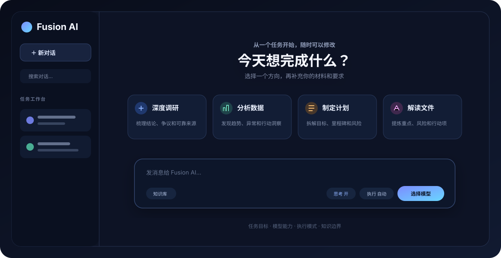
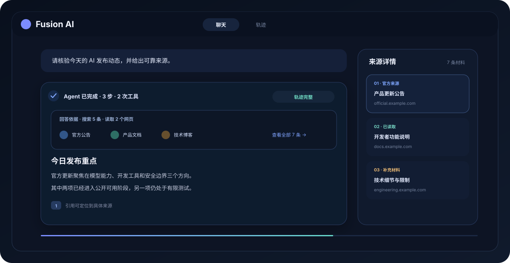
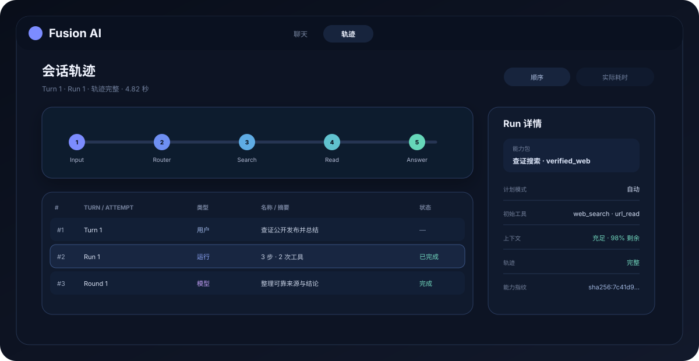
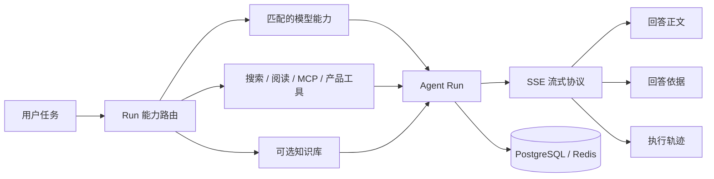

# Fusion

> 面向任务执行的 AI 工作台。

Fusion 让 AI 从“回答问题”走向“完成任务”：它会根据用户意图按需选择模型能力与工具，在一次对话中完成搜索、阅读、规划和结构化执行，并把答案依据与 Agent 运行轨迹完整呈现出来。

[在线体验](https://fusion.seanfield.org/chat/new) · [后端开发](backend/README.md) · [前端开发](frontend/README.md)

[](https://github.com/HyxiaoGe/fusion/actions/workflows/pr-ci.yml)
[](https://github.com/HyxiaoGe/fusion/actions/workflows/deploy-dev.yml)

> 在线环境可能要求登录。模型、工具与知识库能力取决于当前环境配置和所选模型。

## 产品体验

### 从任务出发

从调研、分析、写作、学习或出行等目标开始，也可以直接描述一个复杂任务。Fusion 会保留用户对执行模式、模型和知识库的控制权。



### 让答案有据可查

联网任务可以组合搜索、网页读取与结构化产品工具。回答依据区统一展示采用的搜索来源、已读取网页和知识库引用，正文引用可继续定位到具体材料。



### 看见 Agent 如何完成任务

独立轨迹视图按 Turn 与 Run 还原模型请求、工具调用、上下文状态和耗时，并展示本轮冻结的能力包、计划模式与轨迹完整性。刷新或回到历史会话后，仍可以检查同一份执行事实。



## 核心能力

- **任务感知的能力路由**：区分直接回答、文本转换、实时搜索、可靠来源查证、深度研究、知识库问答和出行任务，只向模型公开当前任务需要且已经授权的工具。
- **可恢复的 Agent 执行**：支持计划控制、流式进度、工具调用、停止与继续执行，以及断线重连和历史恢复。
- **回答依据与执行轨迹**：将“答案用了什么材料”和“Agent 做了哪些步骤”分层呈现，避免把工具日志或内部推理混进正文。
- **结构化任务工具**：支持网页搜索与读取，以及天气、地点、路线、航班、高铁和综合行程等结构化结果。
- **文件与知识库**：文件可随会话使用；启用知识库后，可异步解析、切片、向量化文档，并在回答中定位引用分块。
- **模型与运行治理**：模型目录由 LiteLLM 统一提供；管理员可以查看模型状态、运行配置、MCP 服务、使用量和脱敏审计数据。
- **Web 与桌面客户端**：前端以 Next.js 提供 Web 体验，并保留 Electron 桌面构建入口。

## 工作方式



Fusion 在每个 Run 开始前冻结能力边界，再让模型和工具在同一条 Agent 执行链中协作。聊天正文、回答依据和轨迹视图消费同一组服务端事实，但承担不同的信息职责。

## Monorepo

| 目录 | 作用 | 主要技术 |
| --- | --- | --- |
| [`backend/`](backend/) | API、Agent runtime、能力路由、工具、文件、知识库与治理 | FastAPI、PostgreSQL、Redis、LiteLLM、Milvus |
| [`frontend/`](frontend/) | Web / Electron 客户端、流式会话、回答依据与轨迹界面 | Next.js、React、Redux Toolkit、Dexie |
| [`ops/`](ops/) | 服务部署与运行脚本 | Docker、Bash |
| [`docs/`](docs/) | 设计、实施与验证记录 | Markdown |

## 本地开发

Fusion 的完整运行链路依赖 PostgreSQL、Redis、Auth Service、LiteLLM，以及按需启用的搜索、Reader、MCP、对象存储和 Milvus。仓库目前不提供掩盖这些依赖的根级一键启动脚本。

```bash
git clone https://github.com/HyxiaoGe/fusion.git
cd fusion

cp backend/.env.example backend/.env
cp frontend/.env.example frontend/.env.local
```

接下来按要开发的应用进入对应指南：

- [Backend：依赖、启动、测试与结构](backend/README.md)
- [Frontend：环境变量、启动、测试与结构](frontend/README.md)

## 仓库历史

Fusion 的前后端代码与提交历史已经合并到本仓库。原 `fusion-api` 与 `fusion-ui` 仓库已归档，仅用于历史追溯。
