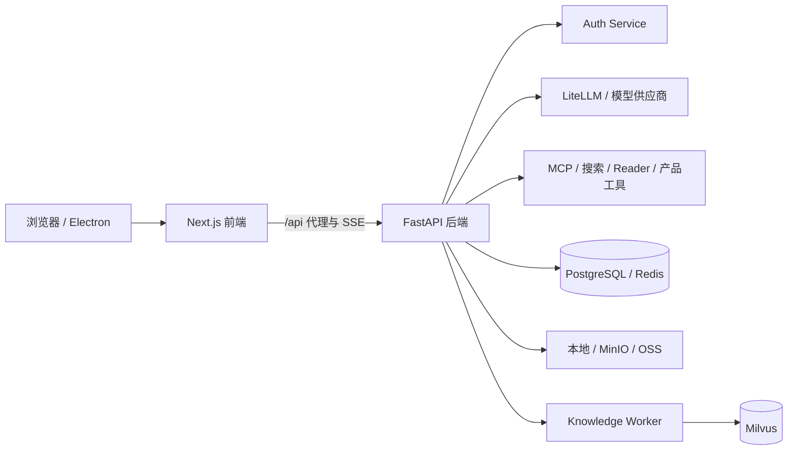

# Fusion

[](https://github.com/HyxiaoGe/fusion/actions/workflows/pr-ci.yml)
[](https://github.com/HyxiaoGe/fusion/actions/workflows/deploy-dev.yml)

Fusion 是一个面向多模型与 Agent 工作流的全栈 AI 聊天产品。它把模型路由、流式对话、工具执行、证据追踪、文件与知识库能力整合在同一套 Web / Electron 体验中，并通过发布账本和按镜像摘要部署保证 dev 环境可追溯、可回滚。

[在线体验](https://fusion.seanfield.org/chat/new) · [后端开发指南](backend/README.md) · [前端开发指南](frontend/README.md) · [执行台账](docs/EXECUTION_LEDGER.md)

> 在线环境可能要求登录。仓库中的示例配置不包含任何可用凭据，请使用自己的数据库、认证服务和模型供应商配置。

## 核心能力

- **多模型对话**：统一模型目录、动态模型管理、BYOK 凭据和流式输出。
- **Agent 工作流**：自动执行、计划控制、工具调用、MCP 接入以及可恢复的运行状态。
- **过程可观测**：展示思考、步骤、工具结果、运行轨迹和上下文状态，而不只呈现最终答案。
- **检索与证据**：支持网页搜索与读取、来源证据、文件处理和基于 Milvus 的知识库检索。
- **持久会话体验**：服务端保存会话与消息，前端通过 Redux 和 Dexie 提供流式渲染与刷新恢复。
- **受控发布**：PR 门禁、API → UI 顺序发布、repository digest 身份校验和独立发布账本。

## 架构



| 目录 | 职责 | 主要技术 |
| --- | --- | --- |
| [`backend/`](backend/) | API、Agent loop、模型治理、工具、文件与知识库 | FastAPI、SQLAlchemy、PostgreSQL、Redis、LiteLLM、Milvus |
| [`frontend/`](frontend/) | Web / Electron 客户端、聊天状态、轨迹与管理界面 | Next.js 15、React 19、Redux Toolkit、Dexie、Electron |
| [`.github/workflows/`](.github/workflows/) | PR 门禁与 dev API → UI 发布编排 | GitHub Actions、Docker Buildx、自托管 runner |
| [`ops/deploy/`](ops/deploy/) | 发布、健康检查、镜像身份与回滚脚本 | Bash、Docker、release ledger |
| [`docs/`](docs/) | 实施计划、设计规格、迁移记录与执行事实 | Markdown |

## 快速开始

### 环境要求

- Node.js 20 与 npm
- Python 3.12
- PostgreSQL 和 Redis
- 可访问的 Auth Service，以及至少一个模型供应商或 LiteLLM 端点

完整登录、模型和知识库链路依赖外部服务。先阅读 [`backend/.env.example`](backend/.env.example) 与 [`frontend/.env.example`](frontend/.env.example)，只配置当前要启用的能力。

### 1. 克隆并准备配置

```bash
git clone https://github.com/HyxiaoGe/fusion.git
cd fusion

cp backend/.env.example backend/.env
cp frontend/.env.example frontend/.env.local
```

编辑两个环境文件，至少设置数据库、Redis、认证服务和模型访问配置。不要提交真实凭据。

### 2. 启动后端

```bash
cd backend
python3.12 -m venv .venv
source .venv/bin/activate
pip install -r requirements.txt
uvicorn main:app --reload --port 8000
```

默认 API 地址为 `http://localhost:8000`。开发环境可通过配置启用 OpenAPI 文档。

### 3. 启动 Web 前端

在另一个终端中运行：

```bash
cd frontend
npm ci
npm run dev:next
```

访问 `http://localhost:3000`。需要 Electron 客户端时改用 `npm run dev`。

> `backend/docker-compose.yml` 面向已经具备 middleware、LiteLLM 等外部 Docker 网络的完整环境，不是零依赖的一键安装脚本。

## 测试与构建

```bash
# 后端
cd backend
pip install -r requirements-ci.txt
ruff check .
pytest -q

# 前端
cd frontend
npm ci
npm run lint
npm test
npm run build
```

PR 由 [`Fusion CI`](.github/workflows/pr-ci.yml) 根据完整差异决定运行 API、UI 或共享检查，并由单一 required gate 汇总结论。`master` 发布由 [`Fusion dev deploy`](.github/workflows/deploy-dev.yml) 按 API → UI 顺序执行；dev 是当前唯一由仓库流水线定义的部署环境。

## 文档导航

- [后端开发指南](backend/README.md)
- [前端开发指南](frontend/README.md)
- [后端聊天核心数据流](backend/CHAT_CORE_DATA_FLOW.md)
- [前端聊天数据流](frontend/CHAT_UI_DATA_FLOW.md)
- [前端架构](frontend/docs/ARCHITECTURE.md)
- [知识库运行手册](backend/docs/KNOWLEDGE_BASE.md)
- [模型验收手册](backend/docs/MODEL_ACCEPTANCE_RUNBOOK.md)
- [执行台账](docs/EXECUTION_LEDGER.md)
- [实施计划](docs/implementation-plans/)
- [设计规格](docs/specs/)

## 协作约定

提交改动前请阅读根目录及对应应用的 `AGENTS.md`。查询近期变更和执行事实时，先在仓库根运行 `git log --oneline -40`，再核对执行台账、实施计划、设计规格与当前代码。

后端遵循 `API → Service → AI → Data` 分层；前端聊天状态按 `SSE → Redux → 渲染 → Dexie / 刷新恢复` 核对。涉及两个应用时，应同时验证协议生产者、传输层和消费方。

## 仓库迁移

当前开发、CI/CD 和 dev 发布均已迁移至本仓库。原 [`HyxiaoGe/fusion-api`](https://github.com/HyxiaoGe/fusion-api) 与 [`HyxiaoGe/fusion-ui`](https://github.com/HyxiaoGe/fusion-ui) 已归档，只用于历史追溯；请勿继续向旧仓提交变更。
