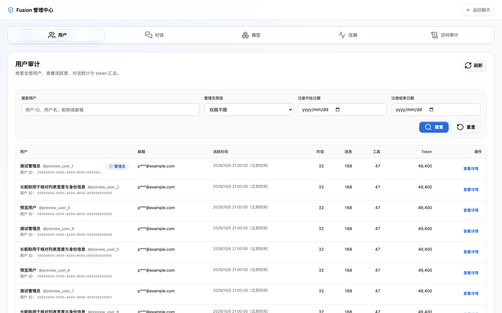
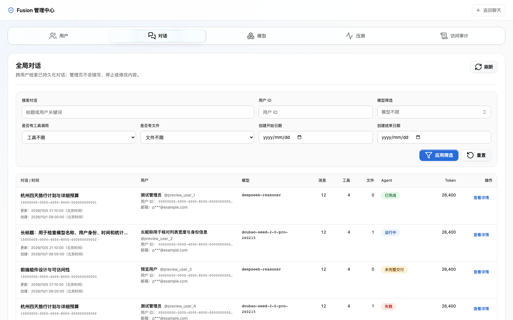
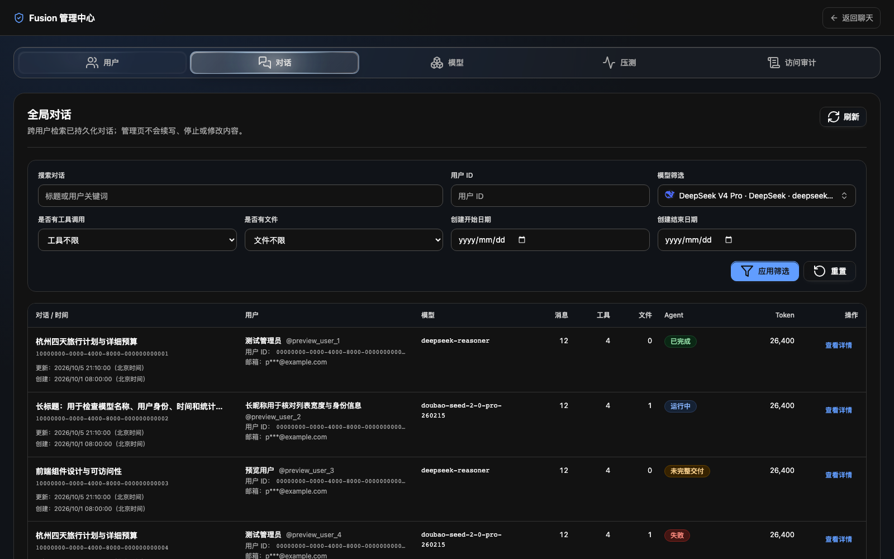

# 管理中心第一轮界面改造

日期：2026-10-05（Asia/Shanghai）。起点：`63c937c4`。独立 worktree：`admin-center-ui/fusion`，分支：`codex/admin-center-ui`。

## 变化

管理中心已有独立路由、权限处理和五个功能面板，但外框、控件与列表的材质不统一，对话的七项筛选在桌面同一行挤压，长 ID 和时间抢占标题空间。

- 共用外框、导航、面板标题和按钮统一材质、焦点与禁用反馈；导航沿用现有 Glass Tabs 并保持可见。新增样式只作用于管理中心及其用户详情/模型菜单，不修改公共 UI 控件。
- 用户/对话筛选增加可见标签；对话常用搜索与模型在第一行，工具、文件和日期在第二行。字段、模型触发器的可见标签与可访问名称使用同一中英文语言键。
- 两个列表采用稳定列宽，标题、用户身份与辅助 ID 分层，统计右对齐。完整 ID 保留在 DOM 和 title 中，详情保留完整身份信息。表格在独立容器滚动，表头固定；窄桌面只在表格内横向滚动。
- Agent 状态使用语义颜色和文字；未完整交付与完成分开，未知状态原样保留为诊断值。
- 导航支持减少透明度降级。表格保持实色，没有逐行 backdrop-filter。

本轮不调整详情 Markdown、执行信息的内容布局，或模型统计/压测导入的主次布局；这些属于后续两轮。请求、接口、权限失效清空、URL/history、Tabs 手动键盘激活、Portal、焦点恢复和硬导航协议保留。

## 验证

### 本地回归与构建

从独立 worktree 的 `frontend/` 执行：

```sh
npm test -- src/components/admin src/lib/admin/adminAuditRoute.test.ts src/lib/api/adminAudit.test.ts src/app/admin/page.test.tsx src/scripts/adminRouteSecurityHeaders.test.ts
npm run build
```

- 16 个测试文件、126 项通过，含新增英文可访问名称及未完整交付/未知状态回归。
- 全部改动 TS/TSX 文件目标 ESLint、`git diff --check` 通过。
- Next.js 生产构建通过。仓库配置跳过构建内类型检查，另行执行 `tsc --noEmit --incremental false` 并与固定起点源码比较：39 个既有诊断逐条一致；不能称全量类型检查通过。
- 独立代码审查及可访问名称修复后的复核未发现新增 P0/P1。

### 本地组件浏览器验证

通过仓库现有 Vite/Playwright 加载真实 `AdminShell`、`AdminAuditCenter` 和下属面板，API 与 Next 路由仅在临时测试入口中替换为确定性测试数据。未启动 Fusion 服务、连接真实 API、复制登录态或发送真实模型请求；未提交该入口、mock 数据或预览脚本。

- 1600×1000 深浅色：筛选两行，每个单宽字段约 355 px；导航、标题、状态及控件直接观察正常。
- 表格内部滚动 400 px 后表头仍固定；主区域滚动 200 px 时导航保持在主区域顶部。
- 模型浮层可见，键盘选择后关闭并恢复触发器焦点。
- 1280×800：页面没有水平溢出，表格容器可横向滚动。
- 模拟 `prefers-reduced-transparency: reduce` 后，导航 `backdrop-filter` 为 `none`。
- 测试组件浏览器没有运行时异常。

上述是本地测试数据与真实组件证据，不代表发布后既有 Chrome 登录态验收。仅授权提交 PR，本轮未合并或部署；真实 dev 验收待发布后进行。

## 截图（本地测试数据）

用户列表，浅色：



对话列表，浅色：



对话列表，深色：


