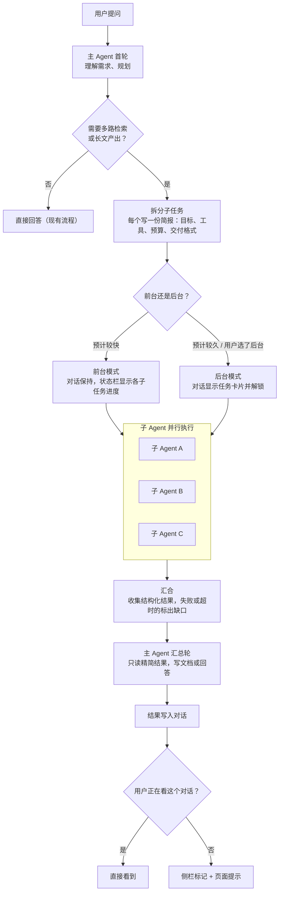
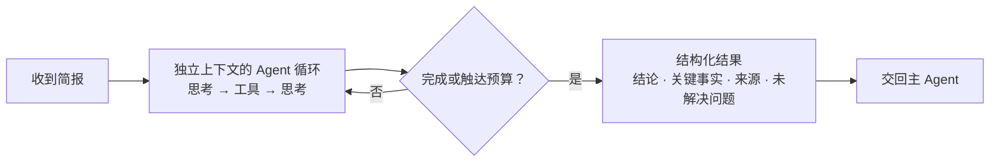
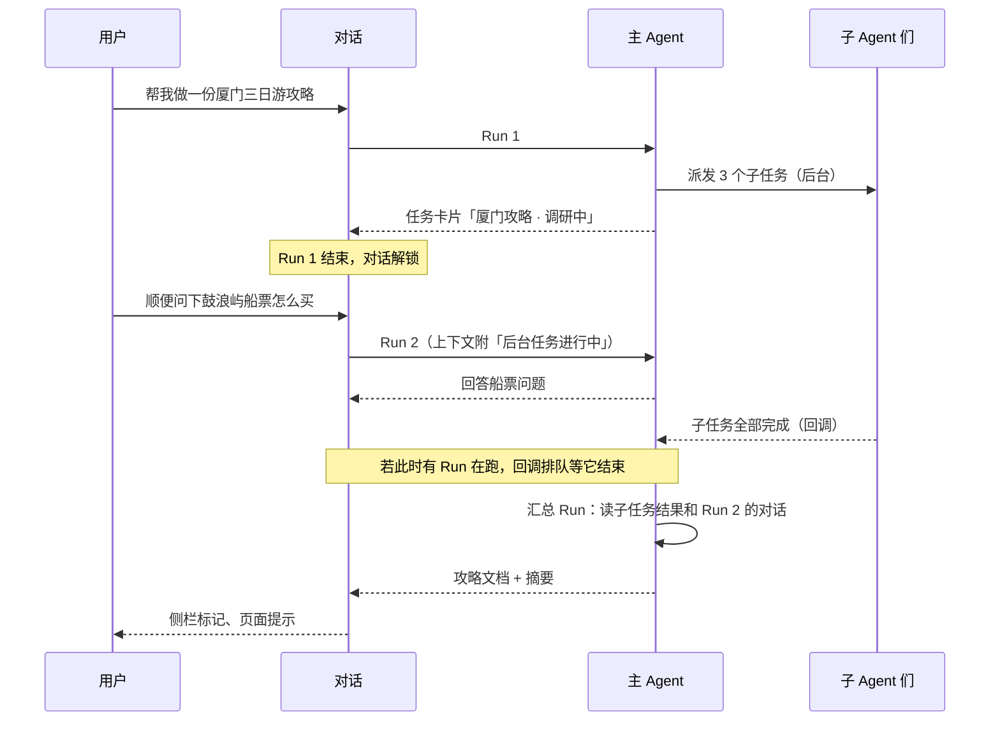
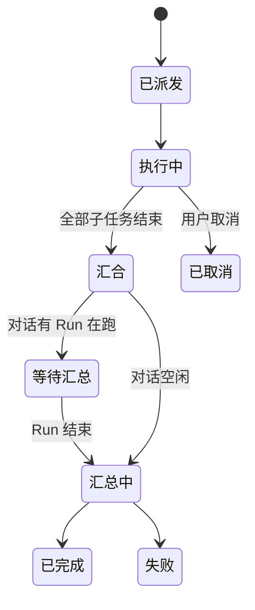

# 子 Agent 与后台任务：调研

日期：2026-10-06　状态：方向已确认，待拆实现

## 1. 背景

对话 `10056324`（厦门三日游攻略，mimo-v2.6-pro）总耗时 7 分 45 秒：8 轮模型调用合计约 439 秒（94%），工具合计约 25 秒。全程一条思考链串行：查资料约 232 秒（第 2–6 轮），写文档 195 秒（先想约 1.2 万字，再写 5084 字）。期间对话被占住，用户只能等。

dev 近 14 天 958 次已结束运行的时长分布：

| 时长 | 次数 | 占比 |
|---|---|---|
| < 30 秒 | 467 | 49% |
| 30–60 秒 | 178 | 19% |
| 1–2 分钟 | 147 | 15% |
| 2–5 分钟 | 131 | 14% |
| 5–10 分钟 | 33 | 3.4% |
| 10–30 分钟 | 2 | 0.2% |

约 17% 的运行超过 2 分钟。

## 2. 结论

- **引入子 Agent**：主 Agent 负责理解需求、拆分、汇总；可并行的检索拆给多个子 Agent，子 Agent 用更快的模型。这是真正缩短耗时的手段。
- **后台任务建立在子 Agent 之上**：前台和后台共用同一套子 Agent 机制，区别只在主 Agent 等不等。
- **纯异步本身不提速**：时间几乎都在模型生成上，挪到后台照样要跑这么久；它改善的是“对话不被占住”。
- **跨部署不中断优先级降低**：正常运营时重启频率不高，dev 上的中断集中在开发期的高频部署，放到最后一期。

已确认的决定：

1. 子 Agent 默认用更快的模型，主 Agent 保留当前模型；具体模型用探针对比后定。
2. P1 只做前台模式，验证拆分质量和提速后再做后台模式。
3. 写文档不拆给子 Agent，仍由主 Agent 一次写完（理由见 5.4）。

## 3. 目标与非目标

**目标**
- 多路检索类长任务明显变快。
- 长任务可以转后台，对话随即释放；完成后回调进对话并通知用户。
- 用户可以随时停止，也可以中途调整。

**非目标**
- 不用关键词或分类器预判“这是长任务”，由模型通过工具声明。
- 不引入 WebSocket（见 8）。
- 第一期不做跨部署续跑（见 10）。

## 4. 总流程



- 是否拆分、拆成几个、前台还是后台，都由主 Agent 通过派发工具声明；用户的“后台任务”开关可以强制走后台。服务端只守边界（权限、并发数、预算），不改写模型的判断。
- 子任务之间无依赖才并行；有依赖的（先查景点再算路线）放进同一个子任务，或分两批派发。

## 5. 子 Agent

### 5.1 内部流程



### 5.2 约束

| 项 | 规则 |
|---|---|
| 上下文 | 只带简报，不带整段对话历史；思考和原始搜索结果不回流主 Agent |
| 工具 | 只能用简报列出的工具 |
| 预算 | 轮数、工具次数、时限单独设上限，低于主 Agent |
| 深度 | 固定为 1，子 Agent 不能再派生子 Agent |
| 模型 | 默认用更快的模型 |
| 用户消息 | 不直接接收，一律经主 Agent（见 7） |
| 外部限额 | 高德目前只在单轮内串行（`tool_executor.py` 的 `_AMAP_PRODUCT_EXECUTION_PRIORITY`）；多个子 Agent 同时跑时改为跨运行的全局限流 |

### 5.3 派发与结果契约（草案）

派发工具 `dispatch_subagents`：

```json
{
  "mode": "foreground | background",
  "title": "厦门三日游攻略",
  "tasks": [
    {
      "id": "spots",
      "goal": "核实鼓浪屿、南普陀、厦大、植物园的开放时间、预约方式与门票",
      "tools": ["web_search", "url_read", "local_place_search"],
      "deliverable": "每个景点一条：开放时间、预约渠道、票价、来源链接"
    }
  ]
}
```

子 Agent 交回：

```json
{
  "id": "spots",
  "status": "succeeded | partial | failed | cancelled",
  "summary": "一段话结论",
  "facts": [{"claim": "...", "source": "..."}],
  "open_issues": ["植物园夜间开放时间未找到官方来源"]
}
```

### 5.4 写文档不拆

写文档仍由主 Agent 根据各子任务结果一次写完：

- **一致性**：按天拆给多个子 Agent 写，容易出现重复推荐、跨天路线衔接不上、风格不统一，合并时还要修补。
- **合并有成本**：主 Agent 还得通读、去重、调顺，省下的时间会被吃掉一部分。
- **这段会自然变短**：现在写文档前的 1.2 万字思考，主要是主 Agent 在原始搜索结果里自己理头绪；拿到精简结果后这段预计明显缩短。

P1 上线后若写文档仍是最大瓶颈，再评估“主 Agent 定大纲和每天路线，子 Agent 按大纲并行写细节，主 Agent 统一润色”。

### 5.5 厦门攻略对照（粗估，需探针实测）

| 阶段 | 现在 | 子 Agent 前台模式 |
|---|---|---|
| 理解与规划 | 约 38 秒 | 约 30 秒 |
| 检索 | 约 232 秒（串行） | 约 60–90 秒（3 路并行，取最慢，子 Agent 用快模型） |
| 写文档 | 195 秒 | 约 120–180 秒 |
| 收尾 | 7 秒 | 约 7 秒 |
| **合计** | **7 分 45 秒** | **约 4–5 分钟** |

## 6. 后台模式

### 6.1 时序



前台模式没有中间那段：Run 1 一直等到子任务汇合，直接进入汇总轮。

### 6.2 任务状态



单个子任务失败不拖垮整体：汇合时标成缺口，主 Agent 在结果里说明哪些信息没查到。

### 6.3 对话锁与回调

- 派发后台任务的 Run 以“任务已开始”正常结束，释放对话锁；任务本身不占锁，但每个对话同时最多一个进行中的后台任务。
- 任务期间用户发的新消息照常开 Run，上下文附任务状态，模型不会重复做。
- 回调时若对话有 Run 在跑，排队等锁释放后再进汇总轮，保证消息顺序。
- 汇总轮是一次普通 Run，复用现有的流式输出、状态栏和轨迹记录。

## 7. 停止与中途调整

### 7.1 现状

- **停止可随时打断**：`/stop/{conv_id}` 撤掉对话的运行锁，模型流每隔固定 chunk 数检查一次锁（`llm_stream.py` 的 `maybe_check_lock_owner`），工具执行也检查（`StreamOwnershipLostError`），运行记为 interrupted。近 14 天有 14 次用户主动停止。
- **运行中不能插话**：运行期间再发消息返回 409“当前会话已有回答正在生成”，只能先停再发。
- **可借鉴的机制**：运行中途向用户要位置时，运行会挂起等待用户通过 `/runs/{run_id}/context/{request_id}` 提交（`submit_agent_context.lua`），提交后继续。“运行中接收用户输入”的通道已经跑通。

### 7.2 三种情况

| 用户想做的 | 处理 |
|---|---|
| 全部不要了 | 停止主 Agent 时级联取消所有子 Agent，子 Agent 用同样的方式检查父任务是否已取消。已完成的子任务结果保留在轨迹里，不进入汇总 |
| 某一路不要了 | 任务卡片上每个子任务单独可取消；主 Agent 汇总时把这一路当缺口 |
| 中途改主意 | 用户的新消息只交给主 Agent，由它决定：不受影响的继续跑，受影响的取消后按新简报重派，必要时补派 |

### 7.3 原则

- **单一决策点**：子 Agent 不直接接收用户消息，避免几个子 Agent 各自理解、互相打架。
- **改简报 = 取消 + 重派**：不往运行中的子 Agent 上下文里塞新指令；已完成的结果照样复用。
- **安全点打断**：模型生成随时可切；只读工具（搜索、天气、路线）可等它跑完或丢弃结果；`create_document` / `edit_document` 这类有副作用的工具不能切在中间，要么等它完成，要么在调用前拦下。

### 7.4 两种模式下的调整

- **后台模式**：对话已解锁，新消息就是普通 Run；上下文带任务状态，主 Agent 用 `adjust_background_task`（取消子任务、重派、补派）调整。
- **前台模式**：运行期间不再直接 409，新消息作为“追加指令”排队，主 Agent 在当前轮结束后读到并调整。

## 8. 通知

- **页面开着**：新增用户级 SSE 通道 `GET /api/events`，推任务状态变化，前端据此更新侧栏、弹提示。dev 已确认走 HTTP/2，多一条常驻连接不会占满浏览器的连接上限。
- **不需要 WebSocket**：数据流是服务端单向推；前端到服务端的操作（发消息、停止、取消子任务）都是低频 HTTP 请求。换成 WebSocket 一样要靠 Redis 在多个 worker 之间转发，还多出保活、粘性路由、代理配置等负担。
- **页面关着**：长连接覆盖不到，后续视需要接浏览器通知或飞书。

## 9. 现有基础

| 需要的能力 | 现状 |
|---|---|
| 子 Agent 执行循环 | `run_agent_loop(messages, state, runtime)`（`agent_loop_driver.py:40`）可复用，换简报、工具集、模型和预算 |
| 父子运行关联 | 事件协议已预留 `parent_run_id`（`services/agent/events.py:25`，目前恒为空） |
| 生成与页面解耦 | `chat_service.py:611` 后台 task + Redis Stream，断线可续 |
| 工具并行 | 同一轮多个工具已并行；子 Agent 之间是新的并行层 |
| 运行上限 | `AGENT_MAX_STEPS=64`、`AGENT_MAX_TOOL_CALLS=200`、`AGENT_TOTAL_TIMEOUT=1800` |
| 停止 | 锁撤销 + 流内检查 + 工具检查，见 7.1 |
| 运行中接收用户输入 | 位置上下文提交通道，见 7.1 |
| 阶段展示 | 状态栏配置表驱动（`activityStatusView.ts`），加子任务进度即可接入 |
| 交付物 | 文档工具与版本表 |
| 任务模式雏形 | `deep_research` 的独立策略，可作为后台模式的首批用户 |

## 10. 跨部署续跑（降级）

现状：运行跑在 API 进程内存里（uvicorn 4 worker），容器停止只给 Docker 默认的 10 秒，部署时正在跑的运行会断。dev 近 14 天有 19 次运行（约 2%）没有结束事件，集中在 09-22 到 09-27 的开发期高频部署与压测。正常运营时重启频率不高，因此排在最后。

届时方案：
- 独立 worker 服务（同镜像换启动命令），队列用 Redis Streams 消费组（`XREADGROUP` / `XACK` / `XAUTOCLAIM`），不新增依赖。
- 以轮次为单位写检查点，恢复时重跑中断的那一轮；`create_document` / `edit_document` 按 `tool_call_id` 幂等。
- worker 收到 SIGTERM 后不再领新任务，等当前轮结束写完检查点再退出。

## 11. 分期

| 期 | 内容 | 效果 |
|---|---|---|
| P1 | 子 Agent 前台模式：`dispatch_subagents` 工具、子运行与 `parent_run_id`、简报与结果契约、并行执行、子 Agent 快模型配置、状态栏子任务进度、轨迹嵌套展示、高德全局限流、级联停止、单个子任务取消；探针对比子 Agent 候选模型 | 长任务变快 |
| P2 | 后台模式：任务卡片、派发后解锁对话、回调排队、汇总 Run；中途调整（后台 `adjust_background_task`、前台追加指令） | 对话不被占住，可中途改主意 |
| P3 | 用户级 SSE 通知、侧栏完成标记 | 不在当前对话也能知道完成 |
| P4 | 跨部署续跑（见 10） | 部署不打断长任务 |

## 12. 风险

- **拆分质量**：拆得太碎会增加汇总负担，拆漏会留缺口。用探针加长任务题观察拆分数量与缺口率。
- **快模型的结果质量**：子 Agent 的事实整理出错会被主 Agent 照单全收。结果契约要求附来源，汇总轮按来源核对。
- **额度**：多个子 Agent 并行，单位时间内的工具和模型调用更集中；需要全局限流和每用户并发上限。
- **模型误用**：主 Agent 可能把短问题也拆分。观察派发率，必要时收紧工具描述，不加硬拦截。
- **用户预期**：后台任务速度不变，任务卡片如实显示已用时长。
