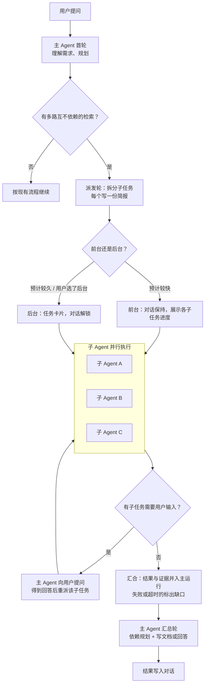
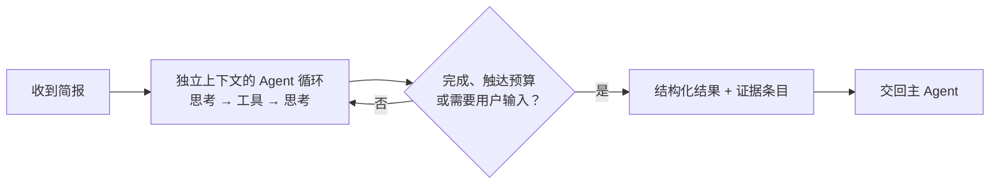
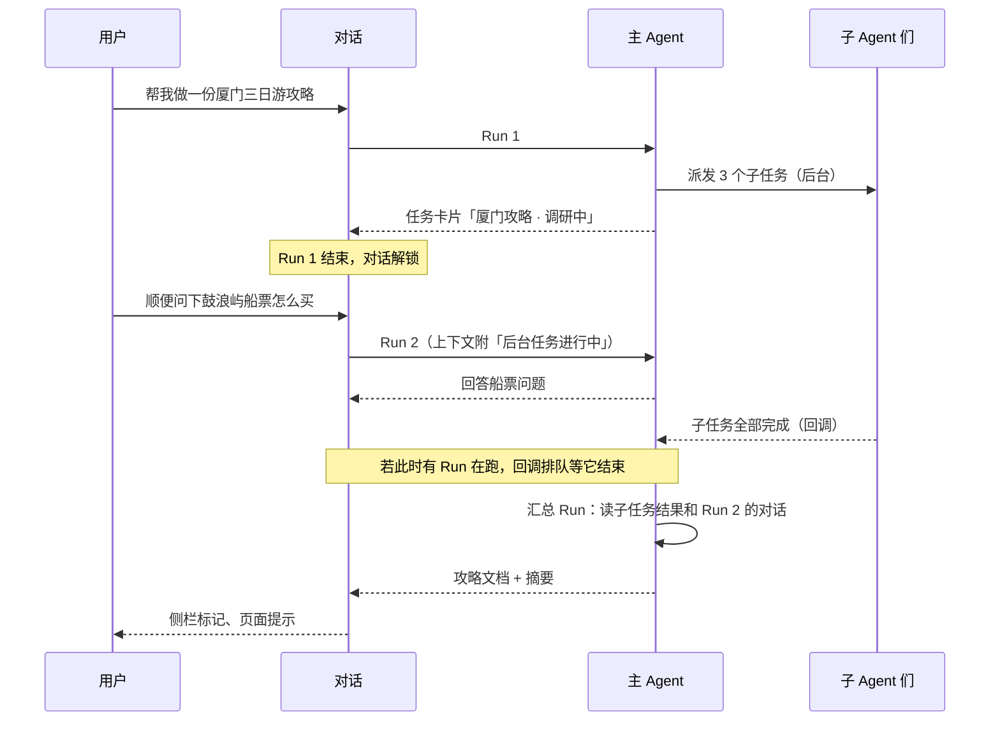
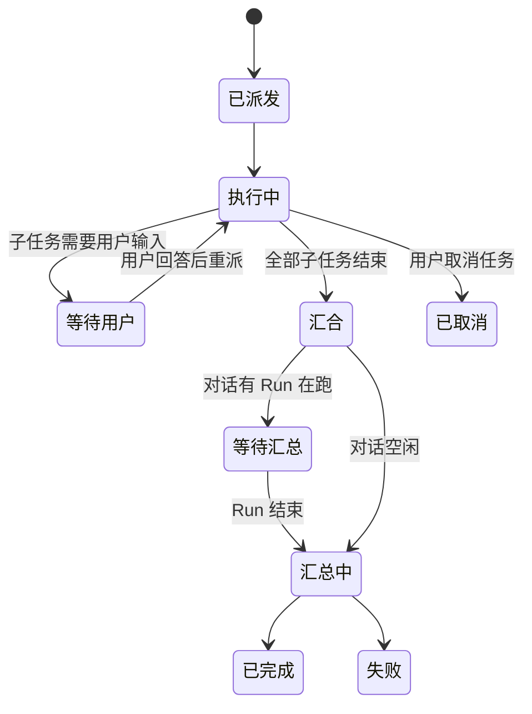

# 子 Agent 与后台任务：调研

日期：2026-10-06（同日经两轮对抗式审查修订，见附录）
状态：方向已确认；先做 P0 离线实验验证收益，再决定是否开工 P1

## 1. 背景

对话 `10056324`（厦门三日游攻略，mimo-v2.6-pro）总耗时 7 分 45 秒（465 秒），模型约 439 秒（94%），工具约 25 秒。按依赖关系重新拆分：

| 段 | 轮次 | 耗时 | 性质 |
|---|---|---|---|
| 理解需求 | 1 | 4.3 秒 | 加载攻略技能 |
| 规划 | 2 | 33.7 秒 | 再加载技能、查天气、定调研方向 |
| 独立检索 | 3–4 | 67.3 秒 | 搜索、地点、读网页；轮内已并行 |
| 依赖规划 | 5–6 | 131.7 秒 | 依据已选景点排路线、调路线比较（攻略技能 §3–4 规定的串行方法） |
| 写文档 | 7 | 195.0 秒 | 先想约 1.2 万字，再写 5084 字 |
| 收尾 | 8 | 6.8 秒 | |

真正可以拆给子 Agent 并行的只有“独立检索”约 67 秒；“依赖规划”依赖前一步选出的景点，拆不开，只会挪到主 Agent 的汇总轮里。

dev 近 14 天 958 次已结束运行中，166 次（17%）超过 2 分钟。这 166 次的画像：

| 指标 | 数值 |
|---|---|
| 模型时间占比（中位） | 86% |
| 单个最长轮次占比（中位） | 44%（p75 56%） |
| 单轮占比 ≥ 50% 的运行 | 61 / 166 |
| 每个工具轮的工具数（中位） | 2.3（轮内已并行） |
| 思考 token 占总输出（中位） | 64% |
| 主模型已是 qwen3.8-flash | 68 / 166（41%） |

## 2. 结论

- **子 Agent 是唯一可能缩短耗时的手段，但上限有限**：最长的那一轮（通常是写文档或汇总）无法并行，按中位 44% 计算，整体提速上限不到 2 倍；41% 的长运行主模型已经是快模型，对它们“子 Agent 换快模型”没有额外收益，只剩并行这一项。
- **厦门攻略的现实预估是 5–7.5 分钟**（详见 5.6），省 0–2.5 分钟；此前写的 4–5 分钟是乐观边界。
- **因此先做 P0 离线实验**：用真实长任务回放，手写简报跑子循环，量出端到端耗时、token 与事实准确率。耗时下降不到 30% 或汇总轮思考不减，就不开工 P1。
- **后台任务建立在子 Agent 之上**：前台与后台共用同一套机制，区别只在主 Agent 等不等。纯异步本身不提速，改善的是“对话不被占住”。
- **跨部署续跑放到最后**：正常运营时重启不频繁，dev 上的中断集中在开发期高频部署。

已确认的决定：

1. 子 Agent 默认用更快的模型，主 Agent 保留当前模型；具体模型用探针对比后定。
2. P1 只做前台模式，验证后再做后台模式。
3. 写文档不拆给子 Agent，仍由主 Agent 一次写完。

## 3. 目标与非目标

**目标**
- 多路独立检索类长任务变快，且引用、来源、事实质量不下降。
- 长任务可转后台，对话随即释放；完成后回调进对话并通知用户。
- 用户可以随时停止，也可以中途调整。

**非目标**
- 不用关键词或分类器预判“这是长任务”，由模型通过工具声明。
- 不引入 WebSocket（见 9）。
- 第一期不做跨部署续跑（见 11）。

## 4. 总流程



- 是否拆分、拆成几个、前台还是后台，都由主 Agent 通过派发工具声明；用户的“后台任务”开关可以强制走后台。服务端只守边界（权限、并发、预算），不改写模型的判断。
- 只拆互不依赖的检索；有依赖的规划（如按已选景点排路线）留在主 Agent。
- 派发本身是额外一轮模型调用，耗时计入估算。

## 5. 子 Agent

### 5.1 内部流程



### 5.2 运行时：去对话化

`run_agent_loop` 本身可复用，但现有 runtime 与对话强绑定，子运行不能照搬：

- `AgentLoopRuntime` 必填 `conversation_id / task_id / assistant_message_id / persist_message_fn`（`agent_loop_runtime.py:18-42`）。
- 写流经 `append_stream.lua`，要求对话锁、meta 的 `task_id` 与 `status=streaming` 同时匹配，否则 `ownership_lost`；锁、流、meta 都只按 `conversation_id` 建，一个对话只有一条流（`stream_state_service.py:110-113`）。
- 收尾按 `assistant_message_id` 落库（`agent_loop_run_completion.py:65-80`）。
- 停止时 `read_stream_partial_content` 会把对话流里所有 `answering/reasoning` 块重组为 partial 落库（`stream_state_service.py:366-397`）。

因此子运行需要一套去对话化的 runtime：

| 项 | 规则 |
|---|---|
| 对话流 | 不写 `answering/reasoning` 文本；只经父 emitter 转发带 `parent_run_id` 的进度事件 |
| run 级事件 | 子运行不发 `run_started/run_completed` 等 run 级终态，避免前端误判主运行结束；前端按 `parent_run_id` 分桶（协议改动前后端同步） |
| 消息 | 不落助手消息，结果只作为父运行的工具结果 |
| 对话锁 | 不持有，取消信号见 8.1 |
| 收尾 | 单独定义：写子运行终态事件与结果，不触发消息持久化与建议问题 |

### 5.3 约束

| 项 | 规则 |
|---|---|
| 上下文 | 只带简报，不带对话历史 |
| 工具 | 只能用简报列出的工具 |
| 预算 | 子运行时限 ≤ 父运行剩余时间减去汇总预留；轮数、工具次数单独设上限。父运行 1800 秒时限包含等待子运行的时间，锁 TTL（`core/redis.py:21-23`，不随 chunk 续期）需同步核算 |
| 深度 | 固定为 1 |
| 模型 | 默认快模型 |
| 用户输入 | 不直接接收用户消息；需要用户输入时停下交回（见 5.5） |
| 技能 | 简报携带相关技能的引用与要点（如攻略技能“每天 3–5 个点、短途不调路线”），否则子 Agent 拿不到方法论 |
| 外部限额 | 高德全局限流（Redis 实现，不依赖 worker 数）；搜索与读网页做跨子运行的缓存去重，避免多个子 Agent 重复查询同一城市 |

### 5.4 证据与引用

子 Agent 不能只交回一个 `source` 字符串。现有引用体系要求证据属于当前运行：

- `valid_citation_indexes` 只认本运行成功读过的 URL（`research_evidence.py:128`）。
- 最终回答的来源从本运行的内容块构建（`final_answer_evidence.py`）。

所以结果契约必须带证据条目，汇合时并入父运行的证据账本并重新编号：

```json
{
  "id": "spots",
  "status": "succeeded | partial | needs_user_input | failed | cancelled",
  "summary": "一段话结论",
  "facts": [{"claim": "南普陀寺需提前一天预约", "evidence_ids": ["e1"]}],
  "evidence": [{"id": "e1", "url": "...", "title": "...", "excerpt": "...", "read": true}],
  "open_issues": ["植物园夜间开放时间未找到官方来源"],
  "user_input_request": null
}
```

这样最终回答的来源角标、引用高亮和用户后续追问“这个时间哪来的”都能正常工作。

### 5.5 需要用户输入

近 14 天 `route_compare` 成功 115/220；同名地点多候选 93 次、待确认 28 次。地点歧义按 #218–#220 的规则必须问用户，不能猜；位置请求（`context_required`）也挂在运行上。

子 Agent 遇到这类情况：停下，以 `needs_user_input` 交回，附候选；主 Agent 向用户提问，得到回答后重派该子任务。这多出一个来回，计入估算。

### 5.6 厦门攻略重新估算

| 段 | 现在 | 子 Agent 前台（估） |
|---|---|---|
| 理解与规划 | 38 秒 | 38 秒 |
| 派发轮（写 3 份简报） | — | 30–50 秒（mimo 输出约 1000 token 的轮次实测 33–51 秒） |
| 独立检索 | 67 秒 | 40–90 秒（取最慢的一路；mimo 工具轮 p50 9.9 秒、p90 49.3 秒，三路取最慢 p50 23.1 秒；子 Agent 至少 3 轮） |
| 依赖规划 + 写文档 | 327 秒 | 195–260 秒（路线规划并入汇总轮） |
| 收尾 | 7 秒 | 7 秒 |
| **合计** | **7 分 45 秒** | **约 5.2–7.5 分钟** |

以 P0 实测为准。

## 6. 写文档不拆

写文档仍由主 Agent 一次写完：按天拆给子 Agent 容易重复推荐、跨天路线衔接不上、风格不统一，合并修补的成本会吃掉省下的时间。P1 上线后若写文档仍是最大瓶颈，再评估“主 Agent 定大纲，子 Agent 按大纲并行写细节，主 Agent 统一润色”。

## 7. 与技能、深度研究的关系

- **技能**：攻略技能规定了串行方法（天气 → 选点 → 分组 → 路线）。派发工具与技能共存时，模型可能不派发（漏用），或派发后自己又把同样的事做一遍。处理：技能文本里写明哪些步骤适合派发；回放评测同时加“应派发”和“不应派发”的用例，统计派发率、重复劳动、缺口率。
- **深度研究**：近 14 天只有 1 次运行使用，且有自己的阶段机（`research_evidence.py:138-160`，工具按 search → read → 空集推进）。不作为子 Agent 或后台模式的首批用户；两者关系在 P1 验证后另定（被子 Agent 取代或保持独立）。

## 8. 停止、取消与中途调整

### 8.1 取消信号与任务注册表

现有停止的信号就是对话锁：`maybe_check_lock_owner` 每 20 个 chunk 调一次 `check_lock_owner(conversation_id, task_id)`（`llm_stream.py:789-797`）。进程内任务表每个对话只记一个任务，登记新任务会取消旧任务（`task_manager.py:19-31`）。这两点都不适合子运行：

- 后台模式下父运行已结束、锁已释放，子运行无锁可查；用户开 Run 2 时 `init_stream.lua` 还会清空对话流。
- 子任务若登记在对话名下，Run 2 一登记就会把它们取消。

因此新增与对话锁解耦的机制，前台、后台共用：

- Redis 取消键 `task:{task_id}:cancel` 与 `subrun:{run_id}:cancel`，子运行的流与工具检查它们。
- 按任务维度的注册表，取消通过 Redis 广播，不依赖同一进程。
- 前台父锁丢失（用户点停止）时同步写取消键；子运行终态记为 `cancelled`，不是 `SUPERSEDED`。

### 8.2 三种情况

| 用户想做的 | 前台模式 | 后台模式 |
|---|---|---|
| 全部不要了 | 点停止：父运行停止并级联取消子运行 | 停止只停当前 Run；取消任务用任务卡片上的独立入口 |
| 某一路不要了 | 进度区单个子任务可取消，主 Agent 当缺口处理 | 同左 |
| 中途改主意 | 新消息打断等待，主 Agent 立即进入一次决策轮：继续、取消重派或补派 | 新消息是普通 Run，主 Agent 用 `adjust_background_task` 调整 |

已完成的子任务结果保留在轨迹里；被取消的不进入汇总。

### 8.3 原则

- **单一决策点**：子 Agent 不直接接收用户消息。
- **改简报 = 取消 + 重派**：不往运行中的子 Agent 上下文里塞指令；已完成的结果复用。
- **安全点打断**：模型生成随时可切；只读工具可等其跑完或丢弃结果；`create_document` / `edit_document` 不能切在中间，要么等完成，要么在调用前拦下。

### 8.4 前台追加指令

现有的位置上下文通道（`submit_agent_context.lua`）是“运行发问、用户作答”的单次应答，要先有运行创建的待答请求，不能接收用户主动插话；只能参考其 Redis 原子校验写法。前台追加指令需要新建：接收端点、队列、`/send` 的 409 分支改造、追加指令落成哪条消息及序号。列为 P2 设计项。

## 9. 后台模式

### 9.1 时序



### 9.2 任务状态



### 9.3 待设计项（P2 开工前补齐）

- **汇总 Run 的归属**：它不由用户消息触发，挂在哪个 `turn_message_id` 下；触顶后能否 continue（`continuation.py:79-84` 按 message_id 取最近一次 limit_reached 的 session）；用户重试 Run 1 时，已在跑的后台任务是重复派发还是先取消。
- **“每对话最多一个后台任务”的原子保证**：两个标签页同时派发、重试或 continue 时用 Redis 或数据库约束兜住。
- **文档版本冲突**：用户在 Run 2 里改了文档，汇总 Run 同时写同一份文档的新版本，以哪个为准。
- **对话历史表示**：派发调用、各子任务结果、任务卡片如何持久化，后续轮次的上下文里如何裁剪，避免长期占用上下文。

### 9.4 通知

- 页面开着：新增用户级 SSE 通道 `GET /api/events` 推任务状态。dev 已确认走 HTTP/2。
- 不需要 WebSocket：数据流是服务端单向推；前端到服务端的操作都是低频 HTTP 请求。
- 页面关着：后续视需要接浏览器通知或飞书。

## 10. 账本与轨迹

现有账本假设“一个对话轮次的多次运行 = 重试/续写”：

- `attempt_index` 取同一 `turn_message_id` 下的 `max + 1`（`session_cache.py:187-199`），有唯一索引 `uq_agent_sessions_turn_attempt`；并行创建子运行会撞索引，串行创建会被轨迹页展示为第 2、3、4 次尝试（`trajectory_query_service.py:650-672`）。
- `parent_run_id` 只存在于事件 envelope（`services/agent/events.py:25`，`emitter.py:123` 写死为 None），`agent_sessions` 没有这一列。

P1 需要一次迁移：`agent_sessions` 增加 `parent_run_id`；子运行不占 `turn_message_id / attempt_index`；轨迹查询、continue 查询排除子运行；轨迹页按父子嵌套展示。同时为 P2 的汇总 Run 预留归属字段，避免再迁移一次。

## 11. 跨部署续跑（降级）

现状：运行跑在 API 进程内存里，dev 实际是 1 个 uvicorn worker（`ops/deploy/api-pull-and-restart.sh` 覆盖了 Dockerfile 的 4），所有子 Agent 也会挤在同一个事件循环里；容器停止只给 Docker 默认的 10 秒。近 14 天有 19 次运行（约 2%）没有结束事件，集中在 09-22 到 09-27 的开发期。

届时方案：独立 worker（同镜像换启动命令），Redis Streams 消费组作队列；按轮次写检查点，`create_document` / `edit_document` 按 `tool_call_id` 幂等；收到 SIGTERM 后等当前轮结束再退出。

## 12. 验证方式

- **P0 离线实验**：取厦门攻略与约 10 个长任务，手写简报，用快模型并行跑子循环，主模型写最终一轮；量端到端耗时、input/output token、外部调用次数、事实与来源准确率。门槛：耗时下降 ≥ 30%，且汇总轮思考明显减少。
- **验收矩阵**：P1 开工前列出“状态 × 用户操作”的组合（派发中、子运行调工具中、汇总中 × 停止、取消单路、刷新、双标签页、追加消息；一路失败、一路超时、全部失败；不派发的普通问题行为不变），每格对应一个自动化测试。
- **确定性测试**：用可控的假模型与假工具固定慢、失败、取消、返回格式错误等时序。
- **不变量巡检**：每个子运行都有终态事件；父运行不会在子运行未结束时完成；停止后无残留锁与取消键；没有孤立的子运行。脚本对 dev 事件数据跑，违反推飞书巡检群。
- **新旧对比**：功能开关默认关闭，探针同题开关两种状态各跑一遍，对比耗时、完整度、缺口率、引用有效率。

## 13. 分期

| 期 | 内容 | 效果 |
|---|---|---|
| P0 | 离线实验（见 12），不改线上代码 | 决定是否开工 |
| P1 | 子 Agent 前台模式，拆成多个 PR：① 去对话化子 runtime + 账本迁移 + 取消键（无模型入口，测试直接调用）② `dispatch_subagents` 工具、结果与证据契约、证据并入父账本、`needs_user_input` 回路 ③ 前端多子任务进度区与单路取消 ④ 高德全局限流 + 搜索读取跨子运行缓存 ⑤ 技能联动与回放用例。全程功能开关，默认只对探针账号打开 | 独立检索类长任务变快 |
| P2 | 后台模式：任务注册表、任务卡片、派发后解锁对话、回调排队、汇总 Run、中途调整、前台追加指令；先补齐 9.3 | 对话不被占住 |
| P3 | 用户级 SSE 通知、侧栏完成标记 | 不在当前对话也能知道完成 |
| P4 | 跨部署续跑（见 11） | 部署不打断长任务 |

## 14. 风险

- **收益不足**：见第 2 节，P0 不达标就停。
- **快模型质量**：事实整理出错会传给主 Agent。证据条目带原文摘录，主 Agent 可对照；探针同时考核事实准确率与来源正确性，不只看速度。
- **额度**：并行使单位时间内的模型与外部调用更集中；子运行首轮要重发系统提示与工具定义（厦门首轮约 8.4k token），享受不到主运行的缓存。P1 起记录每次运行的 token 与外部调用次数。
- **模型误用**：漏用或重复劳动见第 7 节；不加硬拦截。

## 附录：审查记录

两轮对抗式审查（并发与失败模式；收益论证与产品体验），证据均已复核。采纳的主要修订：

1. 基线把第 2 轮同时算进规划与检索；第 5–6 轮是依赖规划而非检索。已重新拆分（第 1 节）。
2. 估算漏了派发轮与“取最慢一路”；提速上限受最长轮次限制。已改为 5.2–7.5 分钟并加 P0 门槛（第 2、5.6 节）。
3. 子运行复用 `run_agent_loop` 需要去对话化，否则撞流锁、写进父消息（5.2）。
4. 账本按 `turn_message_id` 分配尝试序号，需迁移（第 10 节）。
5. 取消信号不能依赖对话锁，进程内任务表会互相取消（8.1）。
6. 原写“运行中接收用户输入的通道已跑通”言过其实，已更正（8.4）。
7. 证据与引用必须随结果并入父运行（5.4）。
8. 子 Agent 遇到地点歧义、位置请求需要交回问用户（5.5）。
9. 技能与派发的关系、深度研究不适合作为首批用户（第 7 节）。
10. dev 实际 1 个 worker（第 11 节）；AGENT 上限 64/200/1800 已在 dev 容器环境变量中核实。
11. 前台追加指令需能打断等待；后台模式停止与取消任务是两个入口（8.2）。
